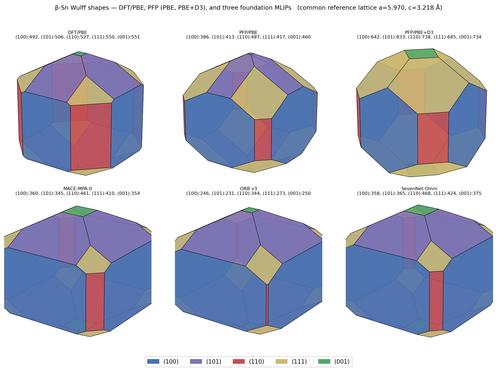

# Foundation MLIP benchmark for β-Sn — comparison against DFT/PBE and PFP

[](LICENSE)

Benchmark of three open-source universal foundation machine-learning interatomic
potentials (**MACE-MPA-0**, **ORB v3**, **SevenNet-Omni**) on **β-Sn**
(tetragonal, I4₁/amd), against:

- **DFT/PBE** (OpenMX 3.9.9, paper Table 1–3 reference)
- **PFP/PBE** and **PFP/PBE+D3** (Preferred Potential v8 on Matlantis), the
  commercial universal potential against which foundation MLIPs are positioned

The benchmark covers:

- bulk lattice constants (a, c, c/a)
- elastic constant tensor (C₁₁, C₃₃, C₁₂, C₁₃, C₄₄, C₆₆) and bulk modulus B
- surface energies γ for five low-index faces (100), (101), (110), (111), (001)
- equilibrium Wulff shapes
- crystal-symmetry preservation under small strain

The protocol matches Tatsumi et al. (in review at MSMSE,
"Comparison of Elastic Constants and Surface Energies of β-Sn"). Numerical values
for DFT/PBE, PFP/PBE, and PFP/PBE+D3 are taken verbatim from that paper and the
companion repository
[**`hirtatsu/beta-Sn-DFT-PFP-MEAM`**](https://github.com/hirtatsu/beta-Sn-DFT-PFP-MEAM).

## Reference data and citation

The DFT/PBE, PFP, and MEAM reference data — including the experimental Cᵢⱼ
reference of Rayne & Chandrasekhar (1960) used throughout this repository — are
from:

> H. Tatsumi, A. M. Ito, A. Takayama, H. Nishikawa.
> *Comparison of Elastic Constants and Surface Energies of β-Sn from Density
> Functional Theory, Universal Machine Learning Potential, and Empirical
> Potentials.*
> *Modelling and Simulation in Materials Science and Engineering* (2026, in review).

Source repository:
[**`hirtatsu/beta-Sn-DFT-PFP-MEAM`**](https://github.com/hirtatsu/beta-Sn-DFT-PFP-MEAM)
(8-method dataset, raw OpenMX/PFP/LAMMPS outputs, all reproduction scripts).

A Zenodo DOI for this foundation-MLIP benchmark will be added on first stable release.

## Hardware

All inference run on a single NVIDIA RTX A4000 (16 GB VRAM, Ampere, CC 8.6),
PyTorch 2.5/2.11 (+CUDA 12.4/13.0 wheels). Each MLIP completes the full
benchmark (bulk + 12 strain configurations + 7 slab terminations) in < 1 minute.

## Methodology (paper-matching)

### Bulk relaxation
- Start from experimental ICSD 40037 (a = 5.831, c = 3.182 Å)
- ASE `ExpCellFilter(hydrostatic_strain=False)` + `LBFGS`
- Force convergence: |F|_max < 0.001 eV/Å

### Elastic tensor
- Apply Voigt strain at ±0.5% in 6 modes (xx, yy, zz, yz, xz, xy)
- For each strain: relax atomic positions only at fixed cell, LBFGS, fmax = 0.005 eV/Å
- Central difference: Cᵢⱼ = (σᵢ(+ε) − σᵢ(−ε)) / (2 Δε)
- Tetragonal 4/mmm symmetrization
- MAPE computed against the experimental Cᵢⱼ of Rayne & Chandrasekhar (1960)
  used in the reference paper: C₁₁=72.3, C₁₂=59.4, C₁₃=35.8, C₃₃=88.4,
  C₄₄=22.0, C₆₆=24.0 GPa

### Surface energies
- Generate slabs from relaxed bulk via pymatgen `SlabGenerator`
  (full termination enumeration, min_slab_size = 15 Å, min_vacuum_size = 15 Å)
- Relax with `FrechetCellFilter(mask=[T,T,F,F,F,T])` + `LBFGS`, fmax = 0.015 eV/Å
- γ = (E_slab − N · μ_Sn) / (2 · A)
- Report minimum-γ termination per face

### Symmetry-preservation diagnostic
- Apply small strain ε_xx = +0.005 to relaxed bulk
- Atomic relax (cell fixed) and check drift of Sn z-coordinate
  (special Wyckoff position 4b at z = 1/4)

See [`METHODOLOGY.md`](METHODOLOGY.md) for full equations and rationale.

## Models tested

| Model | Loader | Training data | Released |
|---|---|---|---|
| **MACE-MPA-0** (medium) | `mace_mp(model='medium-mpa-0')` | MPtrj + Alexandria (PBE52) | 2025 |
| **ORB v3** (orb-v3-conservative-inf-omat) | `orb_v3_conservative_inf_omat()` | OMat24 | 2025/04 |
| **SevenNet-Omni** (modal=omat24) | `SevenNetCalculator(model='7net-omni', modal='omat24')` | 15 open ab initio datasets (13 protocols), multi-task | 2025 |

All three use float64 precision and run on a single CUDA device.

For comparison, the companion paper benchmarks **PFP v8** (Preferred Networks,
on the Matlantis platform), which is a commercial universal MLIP supporting both
PBE and r²SCAN modes with optional Grimme D3 dispersion correction. Two of
PFP's four modes (PFP/PBE, PFP/PBE+D3) are reproduced in the tables and figures
here as reference points for foundation-MLIP positioning.

## Results

### Bulk lattice (paper Table 1)

| Method | a (Å) | c (Å) | c/a |
|---|---:|---:|---:|
| Experiment (ICSD 40037) | 5.831 | 3.182 | 0.546 |
| DFT/PBE | 5.970 | 3.218 | 0.539 |
| PFP/PBE | 5.929 | 3.201 | 0.540 |
| PFP/PBE+D3 | 5.846 | 3.173 | 0.543 |
| MACE-MPA-0 | 5.957 | 3.205 | 0.538 |
| ORB v3 | 5.916 | **3.257** | **0.551** |
| SevenNet-Omni | 5.963 | 3.206 | 0.538 |

MACE-MPA-0 and SevenNet-Omni reproduce DFT/PBE `a` within −0.2 %; ORB v3
overestimates `c` by +1.2 % and shifts c/a from 0.539 to 0.551, the largest
deviation of any method tested.

### Elastic constants (GPa) — paper Table 2 protocol

MAPE is computed against the experimental Cᵢⱼ of Rayne & Chandrasekhar (1960).

| Method | C₁₁ | C₃₃ | C₁₂ | C₁₃ | C₄₄ | C₆₆ | B | MAPE |
|---|---:|---:|---:|---:|---:|---:|---:|---:|
| Experiment | 72.3 | 88.4 | 59.4 | 35.8 | 22.0 | 24.0 | 55.0 | — |
| **PFP/PBE+D3** | 98.5 | 121.1 | 36.2 | 36.5 | **22.9** | 16.2 | 59.4 | **25.1 %** ★ |
| DFT/PBE | 89.7 | 91.8 | 17.4 | 31.5 | 17.9 | 17.6 | 47.8 | 26.0 % |
| PFP/PBE | 114.0 | 104.6 | 41.5 | 41.2 | 29.5 | 31.9 | 64.4 | 31.4 % |
| **MACE-MPA-0** | 68.7 | 79.6 | 41.5 | 26.5 | **6.9** | 13.8 | 45.1 | 30.4 % |
| **SevenNet-Omni** | 67.1 | 77.7 | 40.2 | 24.8 | **6.7** | 12.8 | 43.5 | 33.1 % |
| **ORB v3** | **−87.6** | 65.0 | **+200.6** | 40.9 | **0.5** | 10.2 | 50.5 | **109.2 %** |

Sources for PFP/PBE and PFP/PBE+D3 rows: [`results/pfp_reference/cij_table.csv`](results/pfp_reference/cij_table.csv),
copied from the companion repository.

Three observations specific to the foundation MLIPs:

1. **C₄₄ (shear constant).** DFT/PBE gives 17.9 GPa and PFP/PBE / PFP/PBE+D3
   give 29.5 / 22.9 GPa, all of the correct order against the experimental
   22.0 GPa. The three foundation MLIPs give C₄₄ = 6.9, 6.7, 0.5 GPa
   (MACE-MPA-0, SevenNet-Omni, ORB v3) — a factor 3–40 below experiment.
   This shear-stiffness deficiency, often referred to as the foundation-MLIP
   "softening artifact" in the literature, distinguishes foundation MLIPs from
   PFP within the same universal-MLIP framework.

2. **C₆₆ (basal shear).** DFT/PBE 17.6 GPa and PFP/PBE / PFP/PBE+D3 give
   31.9 / 16.2 GPa. Foundation MLIPs give 13.8 / 12.8 / 10.2 GPa, a similar
   under-prediction as C₄₄ but milder.

3. **ORB v3 negative C₁₁ and C₁₂ = +200.6 GPa.** With internal atomic relaxation
   under ε = ±0.5 % strain, the symmetric-bulk reference is no longer the local
   minimum (see *Symmetry preservation* below). The resulting central-difference
   stress derivative is dominated by the off-symmetric structural transition
   rather than the elastic response of the I4₁/amd phase.

### Surface energies (mJ/m²)

| Method | (100) | (101) | (110) | (111) | (001) | MAE vs DFT | MAPE vs DFT |
|---|---:|---:|---:|---:|---:|---:|---:|
| DFT/PBE | 492 | 506 | 527 | 550 | 551 | — | — |
| PFP/PBE | 386 | 413 | 487 | 417 | 460 | 93 | 17.7 % |
| PFP/PBE+D3 | 642 | 833 | 738 | 685 | 734 | 201 | 38.6 % |
| **SevenNet-Omni** | **358** | 365 | 468 | 424 | 375 | **127** | **24.2 %** |
| MACE-MPA-0 | 360 | 345 | 461 | 410 | 354 | 139 | 26.5 % |
| ORB v3 | 246 | 231 | 344 | 273 | 250 | 256 | 48.8 % |

Sources for PFP rows: [`results/pfp_reference/surface_energies.csv`](results/pfp_reference/surface_energies.csv).

Among the six methods, PFP/PBE has the smallest MAE (93 mJ/m²) against DFT/PBE,
followed by SevenNet-Omni (127 mJ/m²), MACE-MPA-0 (139 mJ/m²), PFP/PBE+D3
(201 mJ/m²), and ORB v3 (256 mJ/m²).

### γ ordering (low → high)

| Method | Ordering | (100) lowest? |
|---|---|:-:|
| DFT/PBE | 100 < 101 < 110 < 111 < 001 | ✓ |
| PFP/PBE | 100 < 101 < 111 < 001 < 110 | ✓ |
| PFP/PBE+D3 | 100 < 111 < 001 < 110 < 101 | ✓ |
| **SevenNet-Omni** | **100** < 101 < 001 < 111 < 110 | ✓ |
| MACE-MPA-0 | 101 < 001 < 100 < 111 < 110 | ✗ |
| ORB v3 | 101 < 100 < 001 < 111 < 110 | ✗ |

DFT/PBE places (001) at the highest γ (smallest Wulff facet); none of the
five non-DFT methods recovers this. Five of the seven non-DFT methods in the
companion paper place (100) at the lowest γ; among the three foundation MLIPs
benchmarked here, only SevenNet-Omni does so.

### Wulff shapes



Common reference lattice a = 5.970, c = 3.218 Å (DFT/PBE) used for all six panels
so that shape differences reflect γ anisotropy alone.

### Symmetry preservation under ε_xx = +0.005

| Method | Δz (Sn 4b) after atomic relax | ΔE (drifted vs symmetric) | I4₁/amd preserved? |
|---|---:|---:|---|
| MACE-MPA-0 | +0.0041 | −0.083 meV/atom | ✓ |
| SevenNet-Omni | +0.0043 | −0.078 meV/atom | ✓ |
| **ORB v3** | **+0.0195** | **−0.563 meV/atom** | ✗ |

For ORB v3 under ε_xx = +0.005, the off-symmetric configuration is 0.563 meV/atom
below the symmetric one — about 7× the energy lowering observed for MACE-MPA-0
and SevenNet-Omni — and the Sn 4b z-coordinate drifts by Δz = +0.0195 (5× the
MACE / SevenNet drift). The off-symmetric drift then propagates into the
central-difference stress evaluation and produces the C₁₁ = −87.6 GPa, C₁₂ =
+200.6 GPa values reported above. PFP/PBE and PFP/PBE+D3, by contrast, preserve
I4₁/amd under the same strain protocol (paper Section 3.1).

## Conclusions

1. **Lattice constants.** MACE-MPA-0 (5.957 / 3.205 Å) and SevenNet-Omni
   (5.963 / 3.206 Å) reproduce DFT/PBE (5.970 / 3.218 Å) within −0.2 / −0.4 %.
   ORB v3 deviates by −0.9 / +1.2 %, with the c/a ratio shifting from
   0.539 to 0.551.

2. **C₄₄ shear stiffness.** All three foundation MLIPs under-predict C₄₄
   (6.9, 6.7, 0.5 GPa for MACE-MPA-0, SevenNet-Omni, ORB v3) relative to
   experiment (22.0 GPa), DFT/PBE (17.9 GPa), and the two PFP modes
   (29.5 / 22.9 GPa). Within the universal-MLIP framework, foundation MLIPs
   thus inherit a quantitative shear-stiffness deficit that PFP does not share.

3. **Cᵢⱼ MAPE ranking against experiment.** PFP/PBE+D3 25.1 %, DFT/PBE 26.0 %,
   MACE-MPA-0 30.4 %, PFP/PBE 31.4 %, SevenNet-Omni 33.1 %, ORB v3 109.2 %.

4. **ORB v3 under strain.** With internal atomic relaxation enabled, ORB v3
   drives the Sn 4b sites off the I4₁/amd Wyckoff position (Δz = 0.0195,
   ΔE = −0.563 meV/atom under ε_xx = +0.005). The off-symmetric local minimum
   propagates into the elastic-tensor central difference and produces
   C₁₁ = −87.6, C₁₂ = +200.6 GPa.

5. **Surface-energy MAE vs DFT/PBE (mJ/m²).** PFP/PBE 93, SevenNet-Omni 127,
   MACE-MPA-0 139, PFP/PBE+D3 201, ORB v3 256. Among the foundation MLIPs,
   only SevenNet-Omni preserves the (100)-lowest-γ ordering of DFT/PBE.

6. **Foundation-model selection for downstream β-Sn fine-tuning.** For
   system-specific fine-tuning workflows in our follow-on Sn-IMC studies
   (distillation from OpenMX reference data), MACE-MPA-0 is the foundation
   model carried forward, on the basis of (a) preservation of I4₁/amd
   symmetry under strain, (b) mature LoRA / frozen-transfer fine-tuning
   ecosystem, (c) LAMMPS ML-IAP integration for downstream MD,
   (d) broad coverage of Sn-IMC chemistry. The C₄₄ deficit shared by all
   three foundation MLIPs (6.7–6.9 GPa for MACE-MPA-0 / SevenNet-Omni;
   0.5 GPa for ORB v3) is the primary motivation for system-specific
   fine-tuning; targeting C₄₄ ≈ 17.9 GPa (DFT/PBE) is the operational goal.

## Repository layout

```
.
├── README.md                          ← this file
├── METHODOLOGY.md                     ← full protocol / equations
├── CITATION.cff                       ← machine-readable citation metadata
├── LICENSE                            ← MIT
├── env/
│   └── requirements.txt               ← pinned package versions
├── scripts/
│   ├── lib_benchmark.py               ← shared benchmark library (paper exp Cij)
│   ├── run_mace.py                    ← MACE-MPA-0 driver
│   ├── run_orb.py                     ← ORB v3 driver
│   ├── run_sevennet.py                ← SevenNet-Omni driver
│   ├── make_comparison.py             ← six-method tables + Wulff figure
│   └── symmetry_test.py               ← symmetry-preservation diagnostic
├── results/
│   ├── benchmark_MACE_MPA0.json       ← MACE-MPA-0 numbers (master)
│   ├── benchmark_ORB_v3.json
│   ├── benchmark_SevenNet_Omni.json
│   ├── beta_Sn_bulk_*.cif             ← MLIP-relaxed bulk structures
│   ├── slabs_input_*/                 ← initial slab CIFs (from pymatgen)
│   ├── slabs_relaxed_*/               ← MLIP-relaxed slab CIFs
│   ├── bulk_relax_*.log               ← LBFGS log per method
│   ├── symmetry_test.json             ← symmetry diagnostic data
│   └── pfp_reference/                 ← PFP/DFT reference data (from companion repo)
│       ├── cij_table.csv              ← Cᵢⱼ + B for 8 methods
│       ├── surface_energies.csv       ← γ for 5 faces × 8 methods
│       ├── bulk_pfp_pbe_d3.json       ← PFP/PBE+D3 relaxed bulk
│       └── SOURCE.md                  ← attribution and provenance
└── figures/
    └── wulff_compare.{png,pdf}        ← 6-panel Wulff figure
```

## Reproducing

```bash
# Set up environment (Python 3.10, CUDA 12.4)
python3.10 -m venv mlip-env
source mlip-env/bin/activate

pip install --index-url https://download.pytorch.org/whl/cu124 torch==2.5.1
pip install mace-torch==0.3.15 'e3nn==0.4.4'    # MACE
pip install orb-models==0.5.5                    # ORB v3 (pulls torch 2.11+CUDA13)
pip install sevenn==0.12.1 'e3nn>=0.5.0'         # SevenNet (upgrades e3nn)
pip install pymatgen wulffpack matplotlib

# Run benchmarks (each ~1 min on RTX A4000)
python scripts/run_mace.py
python scripts/run_orb.py
python scripts/run_sevennet.py
python scripts/make_comparison.py
python scripts/symmetry_test.py
```

⚠️ ORB v3 (orb-models 0.5.5) pulls a newer torch wheel (2.11 + CUDA 13) that
conflicts with the torch 2.5 baseline used by MACE. The dependency-resolver
warnings are harmless if installed in the order above, but separate venvs
are cleaner if you intend to use one model heavily. ORB also requires
`LD_LIBRARY_PATH` to include `nvidia/cu13/lib` from inside its venv:
```bash
export LD_LIBRARY_PATH=$(pwd)/lib/python3.10/site-packages/nvidia/cu13/lib:$LD_LIBRARY_PATH
```

## License

Code: MIT.
Data (CIFs, JSON results): CC-BY-4.0.
PFP reference data in `results/pfp_reference/` is redistributed under the same
CC-BY-4.0 license as the source repository
[`hirtatsu/beta-Sn-DFT-PFP-MEAM`](https://github.com/hirtatsu/beta-Sn-DFT-PFP-MEAM).

## Contact

For questions: tatsumi.jwri@osaka-u.ac.jp
